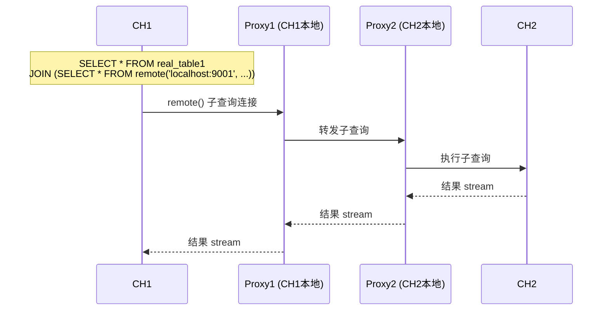
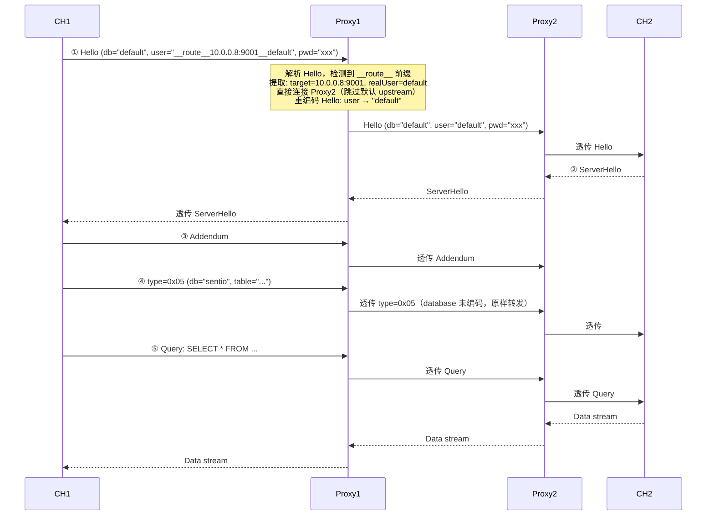

# Remote 子查询转发：缺失组件分析

> 目标：实现 `CH1 → Proxy1 → Proxy2 → CH2` 的子查询转发链。
> 设计原则：CH 进程间不能直接通信，所有请求必须通过 Proxy 转发。
> **关键前提：CH 节点和 Proxy 保证部署在同一台机器上。**

---

## 预期数据流



---

## 缺失组件 1：Remote 地址改写为本地 Proxy（🔴 关键）

### 问题

`remote()` 的 addr 被设置为远程 Proxy2 的地址，CH1 会直接连远程，违反设计原则。

### 代码证据

[rewriter.go L304-338](file:///home/sentio/node/clickhouse-proxy-sdk-table-mapper-integration/pkg/proxy/rewriter.go#L304-L338)：

```go
// L305-306: indexerAddr 是远程 Proxy2 的地址
indexerAddr := fmt.Sprintf("%s:%d", indexerInfo.IndexerUrl, indexerInfo.ClickhouseProxyPort)
isLocal := indexerAddr == r.config.Upstream

// L329-335: remote() 直接使用远程地址
remoteTableMap[table.FullMatch] = RemoteTable{
    Addr:     indexerAddr,     // ← 应改为 localhost + Proxy1 监听端口
    Database: database,
    Table:    physicalTable,
    User:     user,
    Password: password,
}
```

生成的 SQL：`remote('10.0.0.8:9001', ...)` — CH1 会直接连远程 Proxy2，跳过本地 Proxy1。

### 预期修改

> [!IMPORTANT]
> **关键前提：CH 节点和 Proxy 保证部署在同一台机器上。**

`Addr` 应设为 `"localhost" + r.config.Listen`（如 `"localhost:9001"`），使 CH1 的 `remote()` 回到同机器上的 Proxy1。

```go
// 修改后
remoteTableMap[table.FullMatch] = RemoteTable{
    Addr:     "localhost" + r.config.Listen,  // ":9001" → "localhost:9001"
    Database: database,
    Table:    physicalTable,
    User:     user,
    Password: password,
}
```

生成的 SQL 变为：`remote('localhost:9001', ...)` — CH1 连接本地 Proxy1。

---

## ~~缺失组件 2：Proxy 自身地址感知~~ ✅ 已解决

> [!NOTE]
> **此组件已不再需要。** 由于 CH 节点和 Proxy 保证部署在同一台机器上，`remote()` 的 addr 直接使用 `"localhost" + Listen端口` 即可，无需 Proxy 感知自身外部 IP。
>
> `Config.Listen` 已包含端口信息（如 `":9001"`），拼接 `"localhost"` 即得 `"localhost:9001"`，不需要新增任何配置字段。

---

## 缺失组件 3：子查询路由机制（🔴 关键）

### 问题

当 `remote()` addr 改为 `localhost:9001`（Proxy1）后，CH1 的子查询会回到 Proxy1。但 Proxy1 收到的是一条普通 SQL（如 `SELECT * FROM sentio.coinbase_event_Transfer`），**无法知道应转发到 Proxy2 而非本地 CH1**。

### 代码证据

[rewriter.go L213-253](file:///home/sentio/node/clickhouse-proxy-sdk-table-mapper-integration/pkg/proxy/rewriter.go#L213-L253) — `filterSentioNetworkTables` 虽然接受任何 `database.table` 格式，但依赖 processorId 做 `NetworkState` 查找：

```go
parts := strings.SplitN(name, ".", 2)
dbPart := parts[0]    // e.g. "sentio_coinbase" or "coinbase"
tableName := parts[1] // e.g. "transfer"

// 去掉 "sentio_" 前缀得到 processorId
processorId := dbPart
if strings.HasPrefix(strings.ToLower(dbPart), "sentio_") {
    processorId = dbPart[len("sentio_"):]
}
```

子查询中的 SQL 已被改写为物理表名（如 `sentio.coinbase_event_Transfer`），其中 `sentio` 去掉 `sentio_` 前缀后得到空字符串，会被跳过。即使不为空，`NetworkState` 查找也不会匹配到有效的 processorId，Proxy1 会原样转发到本地 CH1。

### 预期修改：路由机制方案

> [!IMPORTANT]
> **拓包验证结论（2026-03-02）：**
> 对 `localhost:19000` 抓包验证 `remote('127.0.0.1:19000', 'MARKER_DB_NAME', 'system.one', 'default', '')` 的协议行为：
>
> | 位置 | 是否包含 MARKER_DB_NAME |
> |------|------------------------|
> | **Hello 包** (type=0x00) | ❌ **不包含**。Hello 中 database = `default`（客户端原始默认 database） |
> | **后续数据包** (type=0x05) | ✅ **包含**。`MARKER_DB_NAME` + `system.one` 作为表引用一起发送 |
>
> **原始抓包数据：**
> ```
> # Hello 包：database = "default"，不是 MARKER_DB_NAME
> 0x0030: ...  00 11 ClickHouse server  19 0c d3 a9 03  00 07 default 00
>
> # 后续包：MARKER_DB_NAME 在此处出现
> 0x0030: 2865 bc94 0501 0e4d 4152 4b45 525f 4442  (e.....MARKER_DB
> 0x0040: 5f4e 414d 450a 7379 7374 656d 2e6f 6e65  _NAME.system.one
> ```

#### ~~方案 A：database 参数编码路由~~ ❌ 不可行

~~在 `remote()` 的 database 参数中编码路由信息，Proxy1 在 Hello 阶段检测 `__route__` 前缀。~~

**拓包验证否决：** `remote()` 的 database 参数 **不会** 出现在 Hello 包的 database 字段中。Hello 包始终携带客户端的原始默认 database（`default`），而非 `remote()` 的 database 参数。因此无法在 Hello 阶段通过 database 字段获取路由信息。

#### 方案 B：user 参数编码路由（Hello 阶段检测）✅ 推荐

`remote()` 的 **user 参数直接出现在 Hello 包的 user 字段中**（与 database 参数不同，user 参数会如实传递）。在 user 中编码路由信息，Proxy1 在 Hello 阶段即可检测并直接路由：

```sql
remote('localhost:9001', 'sentio', 'coinbase_event_Transfer', '__route__10.0.0.8:9001__default', 'password')
```

**编码格式：** `__route__<target_proxy_addr>__<real_user>`
- `target_proxy_addr` = 目标 Proxy2 的地址（如 `10.0.0.8:9001`）
- `real_user` = 原始 user（如 `default`），Proxy1 剥离前缀后用真实 user 重新构造 Hello 转发给 Proxy2

**检测时机：** Hello 阶段。Proxy1 解析 Hello 的 user 字段，检测 `__route__` 前缀，提取目标 Proxy2 地址，**直接连接 Proxy2**（无需先连默认 upstream）。

**关键优势：** user 参数在 Hello 中传递，避免了 database 方案中 "先连默认 upstream，收到 type=0x05 后切换" 的复杂逻辑。

> [!IMPORTANT]
> **与 database 编码方案的对比：**
> - database 参数 **不在** Hello 中（在 type=0x05 中），而 user 参数 **在** Hello 中
> - database 方案需要 "先连默认 → 等 type=0x05 → 断开 → 重连目标" 的复杂切换
> - user 方案在 Hello 阶段直接决策，**一步到位连接正确的 upstream**

**database 保持原值不变：** `remote()` 的 database 参数仍为真实值（如 `sentio`），不做编码。路由信息完全由 user 参数承载。

#### ~~方案 C：ClickHouse Settings 编码路由~~ ❌ 不可行

~~database 保持原值，路由信息通过自定义 ClickHouse Setting 传递：~~

```sql
remote('localhost:9001', 'sentio', 'coinbase_event_Transfer', ...)
SETTINGS _ch_proxy_route = '10.0.0.8:9001'
```

**拓包验证否决（2026-03-02）：** 外层查询的 `SETTINGS` **不会** 通过 `remote()` 传递到远程服务器。

> 验证方法：连接 CH1 (19000)，执行 `SELECT 1 FROM remote('127.0.0.1:29000', ...) SETTINGS max_memory_usage = 12345678` 和 `SETTINGS max_threads = 77`，在 port 29000 抓包。
>
> 结果：CH1 发给 CH2 的包中 **完全没有** `max_memory_usage`、`12345678`、`max_threads`、`77` 中的任何一个。`max_memory_usage` 仅出现在 CH2→CH1 方向的 ServerHello 响应中（CH2 的服务器配置信息）。

#### 方案对比

| 维度 | ~~方案 A: Hello database~~ | **方案 B: user 编码路由** | ~~方案 C: Settings 编码~~ |
|------|:-------------------:|:-------------------:|:-------------------:|
| **可行性** | ❌ 已否决 | ✅ **唯一可行** | ❌ 已否决 |
| **否决原因** | Hello.db ≠ remote().db | — | SETTINGS 不透传 |
| **路由检测时机** | ~~Hello 阶段~~ | ✅ **Hello 阶段** | ~~Query 阶段~~ |
| **Hello 重编码** | ~~需要~~ | ✅ 需要（剥离 `__route__` 前缀，还原真实 user） | ~~不需要~~ |
| **upstream 策略** | — | ✅ **Hello 阶段直连目标**（无需先连默认） | — |
| **database 是否编码** | ~~编码~~ | ✅ 不编码（保持原值） | ~~不编码~~ |

---

## 缺失组件 4：动态 Upstream 路由（🔴 关键，仅 Proxy1）

### 问题

Proxy1 只支持一个固定上游（本地 CH1），无法将子查询路由到远程 Proxy2。

> [!NOTE]
> **Proxy 本身已经是 TCP 服务器，能被动接受任何来源的连接。** `Serve` 方法通过 `ln.Accept()` 接受连接，不区分来源。
> 因此 **Proxy2 不需要任何修改** — 它收到 Proxy1 的转发连接后，默认转发到本地 CH2（`cfg.Upstream`），这恰好是正确的行为。

### `__route__` 路由信息的载体：user 参数

> [!IMPORTANT]
> **方案 B 使用 user 参数编码路由。** `remote()` 的 user 参数 **直接出现在 Hello 包的 user 字段中**。
>
> | 包类型 | user 字段内容 | 说明 |
> |--------|---------------|------|
> | **Hello** (type=0x00) | `__route__10.0.0.8:9001__default` | `remote()` 的 user 参数如实传递 |
>
> 与 database 参数不同（Hello.db 始终为 `default`），user 参数在 Hello 中可见，因此：
> 1. **Hello 阶段即可获取路由信息** — 无需等到 type=0x05
> 2. **无死锁风险** — 不需要 "先连默认 upstream 获取 ServerHello" 的策略
> 3. **Hello 需要重编码** — 剥离 `__route__` 前缀，还原真实 user 后转发

ClickHouse Native TCP 协议中，ClientHello 包含 `user` 字段（[stream_client/main.go L196](file:///home/sentio/node/clickhouse-proxy-sdk-table-mapper-integration/tools/stream_client/main.go#L196)）：

```go
buf.PutString("StreamClient") // client_name
buf.PutUVarInt(22)             // version_major
buf.PutUVarInt(8)              // version_minor
buf.PutUVarInt(54460)          // client_revision
buf.PutString("default")       // database  ← 始终为 "default"
buf.PutString("default")       // user      ← remote() 的 user 参数在此处
buf.PutString("")              // password
```

### Upstream 连接策略：Hello 阶段直连目标

由于 user 参数在 Hello 中可见，Proxy1 可以在 Hello 阶段直接决定 upstream：

1. 收到 Hello → 解析 user 字段 → 检测 `__route__` 前缀
2. 若有路由（`user = "__route__10.0.0.8:9001__default"`）：
   - 提取目标 Proxy2 地址（`10.0.0.8:9001`）和真实 user（`default`）
   - **直接连接目标 Proxy2**（跳过默认 upstream）
   - **重编码 Hello**：将 user 字段替换为真实 user（`default`）→ 转发给 Proxy2
   - Proxy2 返回 ServerHello → 转发给 CH1
3. 若无路由（普通 user）：原样透传到 `cfg.Upstream`（默认本地 CH1）
4. 后续所有包（Addendum、type=0x05、Query 等）原样透传到已选定的 upstream

> [!NOTE]
> **与 database 编码方案的核心区别：** database 方案受限于 "Hello.db ≠ remote().db" 和 "Hello 后阻塞等 ServerHello" 两个约束，必须先连默认 upstream 再切换。user 方案在 Hello 阶段一步完成路由决策和连接，**完全消除了 upstream 切换的复杂性**。

### 完整数据流



### 实现预览

#### 1. 路由解析（从 user 参数解析）

```go
func parseRouteFromUser(user string) (targetAddr, realUser string, isRoute bool) {
    const prefix = "__route__"
    if !strings.HasPrefix(user, prefix) {
        return "", "", false
    }
    rest := user[len(prefix):] // "10.0.0.8:9001__default"
    idx := strings.Index(rest, "__")
    if idx < 0 {
        return "", "", false
    }
    return rest[:idx], rest[idx+2:], true  // "10.0.0.8:9001", "default"
}
```

#### 2. Hello 重编码（剥离 `__route__` 前缀）

```go
// 需要重编码 Hello：将 user 字段从 "__route__10.0.0.8:9001__default" 替换为 "default"
// Hello 格式: [type=0x00] [client_name] [major] [minor] [revision] [database] [user] [password]
//
// 由于 user 字段长度变化（编码后更短），需要重新序列化整个 Hello 包
func rewriteHelloUser(helloBytes []byte, realUser string) []byte {
    // 解析原始 Hello 各字段
    // 替换 user 字段为 realUser
    // 重新编码（UVarInt 长度前缀 + 字符串体）
}
```

> [!NOTE]
> **Hello 重编码是必需的。** 与 database 方案不同（database 在 Hello 中始终为 `default` 不含路由信息），user 方案中 Hello 的 user 字段包含 `__route__` 前缀，必须剥离后才能转发给 Proxy2。

#### 3. handleConnection 修改要点

```go
// 关键变化（user 编码方案）：
//
// 1. 收到 Hello → 解析 user 字段
// 2. 若 user 包含 __route__ 前缀 && 来源为 localhost：
//    a. 提取目标 Proxy2 地址和真实 user
//    b. 重编码 Hello（user → realUser）
//    c. 直接连接目标 Proxy2
//    d. 发送重编码后的 Hello → 等待 ServerHello → 返回给 CH1
// 3. 若无 __route__：原样连接 cfg.Upstream → 透传 Hello
// 4. 后续包原样透传到已选定的 upstream
```

#### 4. rewriter.go 修改（编码路由到 user）

```go
// buildRewriteMappings 中远程表的处理
remoteTableMap[table.FullMatch] = RemoteTable{
    Addr:     "localhost" + r.config.Listen,         // 回到本地 Proxy1
    Database: database,                               // 保持原值（如 "sentio"）
    Table:    physicalTable,
    User:     "__route__" + indexerAddr + "__" + user, // 编码路由到 user
    Password: password,
}
// 生成 SQL: remote('localhost:9001', 'sentio', 'coinbase_event_Transfer',
//                   '__route__10.0.0.8:9001__default', 'password')
```

#### 5. 安全检查

```go
func isLocalConnection(conn net.Conn) bool {
    addr := conn.RemoteAddr().(*net.TCPAddr)
    return addr.IP.IsLoopback()  // 127.0.0.1 或 ::1
}
```

> [!CAUTION]
> **安全约束：仅允许来自本地 CH 的连接使用 `__route__` 路由。**
> 外部客户端如果能构造 `__route__<任意地址>__<user>` 的 user 名，就能让 Proxy 连接到任意目标（SSRF 攻击）。
>
> **检查方式：** 通过 `clientConn.RemoteAddr()` 检查连接来源 IP 是否为 `127.0.0.1`，非本地连接一律忽略路由前缀。
> - 只检查 IP，不检查端口 — CH1 作为客户端发起 `remote()` 连接时，OS 分配的是**临时端口**，而非 CH1 的监听端口
> - 仅检查 localhost 已足够 — 外部攻击者无法伪造 `127.0.0.1` 的 source IP

---

## ~~缺失组件 5：子查询凭证链式传递~~ ✅ 已确认

> [!NOTE]
> **此组件无需额外处理。** 凭证传递流程：
> 1. CH1 发起 `remote('localhost:9001', ..., '__route__<addr>__<user>', 'pwd')`
> 2. Proxy1 解析 Hello，提取真实 user，**重编码 Hello**（user → realUser，password 保留）
> 3. 重编码后的 Hello 转发给 Proxy2 → Proxy2 透传给 CH2
> 4. CH2 使用真实 user + 原始 password 进行认证

---

## ~~缺失组件 6：Proxy 地址发现~~ ✅ 已确认

> [!NOTE]
> **此组件已不再需要。** `IndexerInfo.ClickhouseProxyPort` 确认是远程 **Proxy** 的端口，因此 `indexerAddr`（`IndexerUrl:ClickhouseProxyPort`）就是 Proxy2 的完整地址，可直接用作 `__route__` 的目标地址。
>
> 代码引用 [rewriter.go L305](file:///home/sentio/node/clickhouse-proxy-sdk-table-mapper-integration/pkg/proxy/rewriter.go#L305)：
> ```go
> indexerAddr := fmt.Sprintf("%s:%d", indexerInfo.IndexerUrl, indexerInfo.ClickhouseProxyPort)
> // indexerAddr = Proxy2 的地址，可用于 __route__ 路由目标
> ```

---

## 汇总

| # | 缺失组件 | 严重性 | 核心修改文件 |
|---|---------|:------:|------------|
| 1 | Remote 地址改写为本地 Proxy | 🔴 | `rewriter.go` |
| 2 | ~~Proxy 自身地址感知~~ | ✅ 已解决 | 无需修改（使用 localhost） |
| 3 | 子查询路由机制（user 编码） | 🔴 | `rewriter.go`, `proxy.go` |
| 4 | 动态 Upstream 路由（Hello 阶段直连） | 🔴 | `proxy.go` |
| 5 | ~~凭证链式传递~~ | ✅ 已确认 | 无需修改（Hello 重编码保留 password） |
| 6 | ~~Proxy 地址发现~~ | ✅ 已确认 | 无需修改（`indexerAddr` 即 Proxy2 地址） |

> [!NOTE]
> **拓包验证已完成（2026-03-02）。** 三项关键发现：
>
> **发现 1：database 传递位置**
> `remote()` 的 database 参数 **不在 Hello 中传递**（Hello 始终为 `default`），而是在 type=0x05 包中与 table 名一起发送。
>
> **发现 2：协议流序约束**
> CH1 发送 Hello 后 **阻塞等待 ServerHello**，不会继续发送后续包。
>
> **发现 3：SETTINGS 不透传**
> 外层查询的 `SETTINGS`（如 `max_memory_usage`、`max_threads`）**不会** 通过 `remote()` 传递到远程服务器。
>
> **对实现方案的影响（方案 B 更新为 user 编码）：**
> - ~~方案 A（Hello database 编码路由）~~ → ❌ 已否决（Hello.db ≠ remote().db）
> - **方案 B（user 参数编码路由，Hello 阶段检测）→ ✅ 唯一可行方案**
> - ~~方案 C（Settings 编码路由）~~ → ❌ 已否决（SETTINGS 不透传）
> - Hello 重编码 → ✅ 需要（剥离 `__route__` 前缀，还原真实 user）
> - ~~延迟 upstream 连接~~ → ✅ `user` 方案无此问题（Hello 阶段直连）
> - upstream 连接策略 → **Hello 阶段解析 user，直连目标 Proxy2（无需先连默认再切换）**
